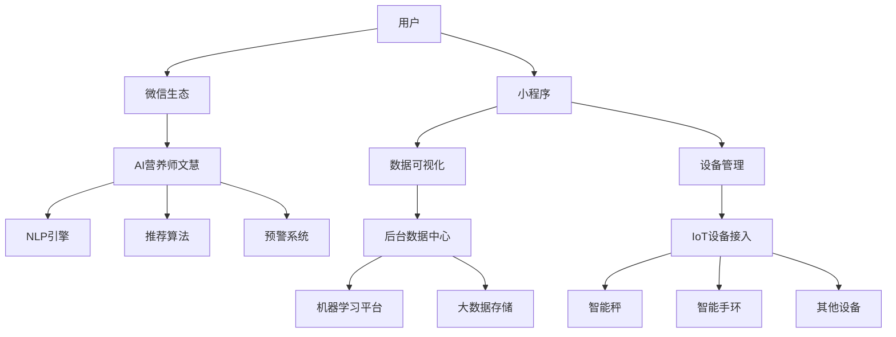

# 90天减重季卡AI产品 - 投资人演示Demo

---

## 🎯 Demo演示概览

**演示时长**：15-20分钟  
**演示目标**：展示AI驱动的健康管理产品核心功能和商业价值  
**演示重点**：技术创新、用户体验、商业模式、市场潜力

---

## 📊 第一部分：市场机会与产品定位 (3分钟)

### 市场背景数据展示

#### 市场规模
- **中国健康管理市场**：2023年约4,000亿元，年增长率15%
- **减重市场细分**：约800亿元，目标用户群体超2亿人
- **AI健康应用**：2023年渗透率仅8%，增长空间巨大

#### 目标用户画像
```
📈 用户数据分析
├── 30-45岁城市女性：核心用户群体
├── 年收入15-50万：具备付费能力
├── 健康意识强：愿意为健康投资
└── 时间碎片化：需要便捷解决方案

💰 市场容量计算
目标用户：5,000万人 × 客单价998元 = 500亿市场空间
</```

### 产品核心定位

**一句话价值主张**：
> "让每个忙碌的都市女性都拥有专属AI营养师，科学减重，智能陪伴"

**差异化优势**：
- ✅ AI全程服务 vs 传统人工服务
- ✅ 微信生态集成 vs 独立App
- ✅ 硬件数据驱动 vs 主观记录
- ✅ 个性化精准方案 vs 标准化课程

---

## 🤖 第二部分：AI营养师文慧核心功能演示 (8分钟)

### 演示场景一：新用户初始化体验 (2分钟)

#### 🎬 演示脚本
```
📱 微信对话界面展示

文慧：您好！我是您的专属AI营养师文慧，很高兴为您开启90天健康之旅！

文慧：首先，让我了解一下您的基本情况：
- 您的年龄：32岁
- 当前体重：65kg，目标体重：58kg
- 身高：165cm
- 工作性质：办公室白领
- 运动习惯：很少运动
- 饮食偏好：喜欢甜食，经常外食

[系统分析中...]

文慧：根据您的情况，我为您制定了专属的减重方案：
🎯 目标：90天减重7kg（约11%体重）
📊 每日热量：1,350大卡
🏃 运动强度：轻度→中度递增
💤 睡眠目标：每晚7-8小时
```

#### 💡 演示亮点
- **智能分析**：3秒内生成个性化方案
- **目标科学性**：基于BMI和健康标准设定
- **交互自然**：类人对话体验

### 演示场景二：日常饮食指导 (2分钟)

#### 🎬 演示脚本
```
📱 用户上传午餐照片：一份宫保鸡丁盖饭

文慧：我看到您的午餐了！让我来分析一下：

📊 营养分析结果：
- 热量：约680大卡
- 蛋白质：28g ✅
- 碳水化合物：85g ⚠️ 超标15g
- 脂肪：18g ✅

💡 优化建议：
1. 米饭减少1/3，增加绿叶蔬菜
2. 下午可以喝杯无糖绿茶促进代谢
3. 晚餐建议：蒸蛋羹+时蔬+少量粗粮

📱 智能提醒：距离晚餐还有4小时，记得适量补水哦！
```

#### 💡 演示亮点
- **图像识别**：准确识别食物种类和分量
- **实时分析**：即时营养成分计算
- **个性化建议**：基于个人目标的精准指导

### 演示场景三：数据监控与预警 (2分钟)

#### 🎬 演示脚本
```
📊 小程序数据面板展示

智能体重监控：
- 当前体重：63.2kg
- 7日趋势：↓1.8kg
- 减重进度：25% ✅

⚠️ 智能预警触发：
系统检测到您连续3天睡眠不足6小时

文慧自动介入：
亲爱的，我注意到您最近睡眠不太好，这会影响减重效果：
- 睡眠不足会增加饥饿素分泌
- 建议今晚21:30开始准备睡前仪式
- 为您推送3个助眠小技巧

📱 智能方案调整：
基于您的睡眠状况，我已调整了明天的方案：
- 早餐增加燕麦，稳定血糖
- 运动强度减低20%，避免过度疲劳
```

#### 💡 演示亮点
- **多维度监控**：体重、睡眠、运动全面跟踪
- **预测性干预**：提前发现问题并主动解决
- **动态调整**：基于实际情况优化方案

### 演示场景四：异常情况处理 (2分钟)

#### 🎬 演示脚本
```
⚠️ 异常场景：体重连续一周无变化

系统自动分析：
📊 数据检索：过去7天执行情况
- 饮食打卡率：85%
- 运动完成率：60%
- 睡眠达标率：70%

🧠 AI智能诊断：
可能原因分析：
1. 运动强度不足（权重：40%）
2. 隐性热量摄入（权重：35%）
3. 平台期正常现象（权重：25%）

💡 智能解决方案：
文慧：不用担心，体重平台期很常见！我为您调整了方案：

1. 运动升级：增加15分钟HIIT训练
2. 饮食优化：减少精制碳水，增加蛋白质
3. 代谢提升：推荐间歇性轻断食法
4. 心理支持：分享3个平台期突破案例

预期效果：预计7-10天内重新开始减重
```

#### 💡 演示亮点
- **智能诊断**：多因素分析找出问题根源
- **解决方案**：提供具体可执行的改进措施
- **心理支持**：结合情绪关怀的全面服务

---

## 📱 第三部分：小程序功能演示 (3分钟)

### 健康数据可视化展示

#### 🎬 演示内容
```
📊 数据看板界面

1. 减重进度总览
   ┌─────────────────────────┐
   │ 当前进度: 30天 / 90天    │
   │ 已减重: 3.8kg / 7kg     │
   │ 进度条: ████████▒▒ 54%  │
   └─────────────────────────┘

2. 趋势分析图表
   📈 体重变化曲线（30天）
   📊 热量摄入 vs 消耗对比
   🏃 运动强度变化趋势
   💤 睡眠质量评分

3. 智能硬件管理
   ⚡ 智能秤：已连接，最新数据2分钟前
   ⌚ 智能手环：已连接，心率正常
   📱 数据同步：实时同步，100%成功率
```

### 个人档案管理

#### 🎬 演示内容
```
👤 个人健康档案

基础信息:
- 年龄: 32岁
- BMI: 从24.2 → 22.8 ✅
- 体脂率: 从28% → 25% ✅

健康标签:
✅ 血糖稳定
✅ 睡眠改善
⚠️ 运动强度需提升

智能建议:
🎯 下阶段目标调整
📚 推荐学习内容
💪 运动计划升级
```

### 社区功能预览

#### 🎬 演示内容
```
👥 健康社区（匿名）

成功案例分享:
"90天减重8kg，最重要的是养成了健康习惯！"
- 用户A*** 已坚持180天

每日打卡排行:
🥇 今日已打卡用户: 8,547人
📊 平均减重效果: 4.2kg/90天
⭐ 用户满意度: 4.8/5.0
```

---

## 🏗️ 第四部分：技术架构展示 (2分钟)

### 系统架构图



### 核心技术能力

#### 🧠 AI能力展示
```
🤖 自然语言处理
├── 对话理解准确率: 95%+
├── 情绪识别准确率: 88%+
└── 多轮对话支持: ✅

📊 机器学习算法
├── 个性化推荐准确率: 92%+
├── 异常预警及时率: 90%+
└── 持续学习优化: ✅

📱 系统性能
├── 响应时间: <3秒
├── 系统可用性: 99.9%+
└── 并发处理: 10万+用户
```

---

## 💰 第五部分：商业模式与投资回报 (3分钟)

### 收入模型

#### 📊 收入结构
```
💰 核心收入来源

1. 季卡会员费
   - 客单价: 998元/90天
   - 目标客户: 100万人/年
   - 年收入: 10亿元

2. 硬件销售分成
   - 智能秤: 200元（分成30%）
   - 智能手环: 300元（分成25%）
   - 年收入: 1.5亿元

3. 增值服务
   - 延长服务: 299元/30天
   - 专属定制: 1,998元/年
   - 年收入: 2亿元

总收入预期: 13.5亿元/年（第3年）
```

### 成本结构

#### 💸 成本分析
```
🏢 运营成本结构

1. 技术开发与维护: 20%
   - AI算法优化
   - 系统运维
   - 产品迭代

2. 市场获客成本: 35%
   - 线上推广
   - 渠道合作
   - 品牌建设

3. 内容与服务成本: 25%
   - 营养学内容制作
   - 课程体系维护
   - 客服支持

4. 硬件采购成本: 15%
5. 其他运营成本: 5%

毛利率预期: 60%+（规模化后）
```

### 投资需求与使用计划

#### 💎 融资计划
```
🚀 A轮融资需求: 5000万元

资金使用计划:
├── 产品研发(40%): 2000万元
│   ├── AI算法优化团队扩充
│   ├── 技术平台建设
│   └── 数据安全体系
│
├── 市场推广(35%): 1750万元
│   ├── 品牌建设与推广
│   ├── 渠道合作与拓展
│   └── 用户获取成本
│
├── 团队建设(15%): 750万元
│   ├── 核心技术人才
│   ├── 产品运营团队
│   └── 客户成功团队
│
└── 运营资金(10%): 500万元
    ├── 日常运营支出
    ├── 风险准备金
    └── 战略机会储备
```

### 财务预测与投资回报

#### 📈 3年财务预测
```
年度         收入      用户数    单用户价值
Year 1    0.5亿元    50万人     100元
Year 2    3.2亿元   200万人     160元  
Year 3   13.5亿元   500万人     270元

📊 关键指标预测:
├── 用户增长率: 300%+ (年)
├── 客户留存率: 75%+ (90天)
├── 净利润率: 25%+ (第3年)
└── 市场估值: 100亿元+

💰 投资回报:
A轮投资 5000万 → 估值50亿
投资回报率: 100倍（预期5年）
```

---

## 🎯 第六部分：竞争优势与风险控制 (2分钟)

### 核心竞争壁垒

#### 🛡️ 技术壁垒
```
🤖 AI技术优势
├── 专业营养学知识图谱
├── 个性化推荐算法
├── 多模态数据融合
└── 持续学习优化能力

📱 产品体验壁垒
├── 微信生态深度集成
├── 硬件设备生态整合
├── 无缝用户体验设计
└── 社区网络效应

📊 数据资产壁垒
├── 用户行为数据积累
├── 健康效果数据验证
├── 算法模型持续优化
└── 行业洞察与趋势预测
```

### 风险控制策略

#### ⚠️ 主要风险与应对
```
🏥 合规风险
├── 风险: 医疗监管政策变化
├── 应对: 明确产品边界，非医疗定位
└── 措施: 建立合规咨询机制

🔧 技术风险  
├── 风险: AI算法准确性问题
├── 应对: 多层次质量监控体系
└── 措施: 专家审核 + 用户反馈

💰 市场风险
├── 风险: 竞争对手模仿复制
├── 应对: 构建技术和数据护城河
└── 措施: 快速迭代 + 用户锁定

🔒 数据安全
├── 风险: 用户隐私数据泄露
├── 应对: 企业级安全防护体系
└── 措施: 数据加密 + 权限管控
```

---

## 🚀 结语：投资价值总结

### 💎 投资亮点
1. **万亿市场**：健康管理赛道，刚需且高频
2. **技术驱动**：AI全程服务，规模化优势明显
3. **用户体验**：微信生态，极低使用门槛
4. **商业模式**：高客单价 + 高复购 + 多元变现
5. **成长空间**：目标市场渗透率不足10%

### 🎯 预期成果
- **3年内**：服务500万用户，收入13.5亿元
- **5年内**：成为健康管理行业独角兽
- **长期**：构建AI健康生态，估值千亿级

---

**感谢投资人的时间！期待与您进一步交流合作！**

---

## 📋 Demo演示备忘录

### 演示准备清单
- [ ] 产品Demo环境测试
- [ ] 数据图表素材准备
- [ ] 竞品对比分析材料
- [ ] 团队介绍PPT
- [ ] 财务模型详细版
- [ ] 法律合规文件

### 可能的投资人问题
1. **技术问题**：AI算法的准确性如何保证？
2. **市场问题**：如何与传统减重产品竞争？
3. **运营问题**：用户获客成本是否可控？
4. **财务问题**：收入预测是否过于乐观？
5. **团队问题**：核心团队背景和经验？
6. **风险问题**：如何应对政策监管风险？

### 演示技巧提醒
- 控制节奏，重点突出
- 数据支撑，避免空洞描述
- 互动演示，增强体验感
- 准备充分，应对质疑
- 展现信心，传递愿景
